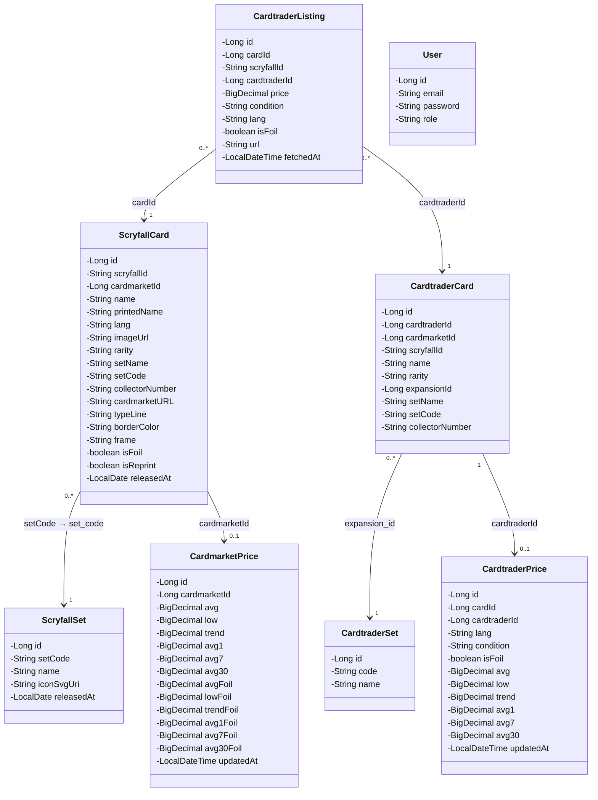
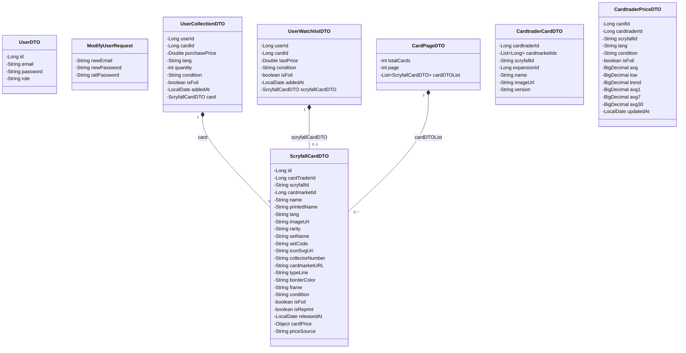
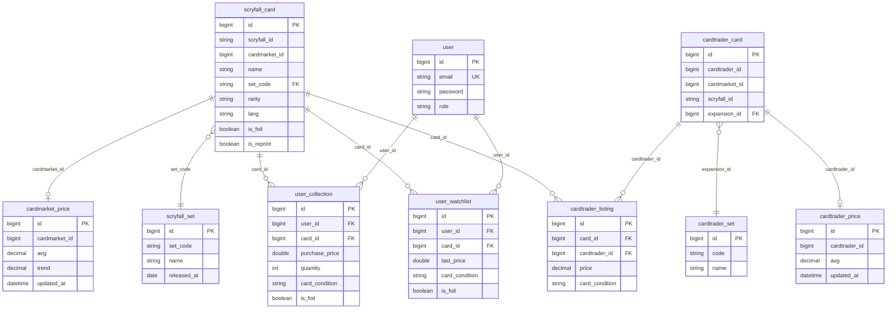

# Diagramas técnicos — Magic Investor

> Generado a partir del código real de [`investor-api`](../investor-api) en el repositorio `MagicCardManager`. Complementa a [`DOCUMENTACION_TECNICA.md`](DOCUMENTACION_TECNICA.md).

## Índice

1. [Diagrama de clases — Entidades JPA](#1-diagrama-de-clases--entidades-jpa)
2. [Diagrama de clases — DTOs](#2-diagrama-de-clases--dtos)
3. [Diagrama entidad-relación (BD real)](#3-diagrama-entidad-relación-bd-real)
4. [Notas sobre fuentes y discrepancias](#4-notas-sobre-fuentes-y-discrepancias)

---

## 1. Diagrama de clases — Entidades JPA

Entidades `@Entity` reales del proyecto (paquete `com.magic.investor_api.*.model`). Ninguna declara relaciones JPA (`@ManyToOne`, `@OneToMany`...): todas las claves foráneas son campos planos (`Long`), y las uniones se resuelven a mano en los DAO con SQL (`JOIN`). Las relaciones del diagrama son, por tanto, **relaciones lógicas por clave foránea**, no relaciones JPA declaradas.

---

## 2. Diagrama de clases — DTOs

Objetos de transferencia entre capas y hacia el frontend (paquetes `*.dto`). Se muestran junto a la entidad `User`, que no tiene DTO propio salvo `UserDTO`.

**Nota:** `ScryfallCardDTO.cardPrice` está tipado como `Object` en el código — agrega el precio final de la carta, que puede provenir de Cardmarket o de CardTrader según `priceSource`. Esto resuelve, a nivel de DTO, la falta de un identificador común entre las tres fuentes externas.

---

## 3. Diagrama entidad-relación (BD real)

Basado en los nombres de tabla y `JOIN`s usados realmente en los DAO (`ScryfallCardDAO`, `UserDAO`, `CardmarketPriceDAO`), no en el fichero `BD_MAGIC.sql` del repositorio, que está desactualizado.

---

## 4. Notas sobre fuentes y discrepancias

- Estos diagramas se han construido leyendo directamente `investor-api/src/main/java/...` (entidades `@Entity`, DTOs) y las sentencias SQL de los DAO — no a partir de documentación previa ni de memoria de conversaciones anteriores.
- `BD_MAGIC.sql` (raíz del repo) **no coincide** con el esquema real usado por el código: tablas (`card` vs `scryfall_card`), claves primarias (`VARCHAR(36)` vs `BIGINT AUTO_INCREMENT`) y ausencia de `user_collection`/`user_watchlist`. Si ese `.sql` se usa para desplegar la BD en algún entorno, conviene regenerarlo o eliminarlo para evitar confusión.
- Ninguna entidad declara relaciones JPA (`@ManyToOne`, etc.); todo el acceso relacional se hace manualmente vía JDBC en los DAO. Esto es coherente con la decisión de diseño ya documentada de usar DAO manual para tener control total sobre las queries.
- Este documento no sustituye a `DOCUMENTACION_TECNICA.md`; lo complementa. Si tras tu revisión decides ajustar la documentación técnica (por ejemplo, para reflejar que CardTrader ya está implementado), dímelo y lo actualizo.
